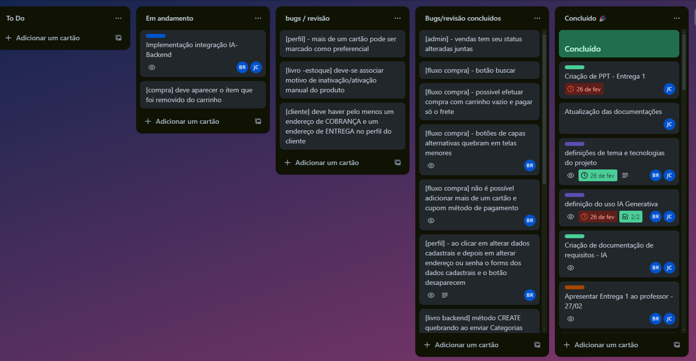

# E-commerce de livros

Este projeto é um e-commerce de livros desenvolvido utilizando ReactJS, JavaScript, Context API, TailwindCSS e Axios.
Note que é necessário também baixar, instalar e rodar o repositório backend para que a aplicação funcione corretamente.

- [repositório do backend ](https://github.com/rodriguessbarbara/backend)

## ⚠️ Instalação

> Para executar o projeto localmente, siga os passos abaixo:

#### BackEnd

Em seu terminal:

1. Rodar `npm install` ;
2. Rodar `npm run dev`;

#### FrontEnd

Em seu terminal:

1. Rodar `npm install` em seu terminal;
2. Rodar `npm run dev` e abrir [http://localhost:5173](http://localhost:5173) em seu navegador.

## 💡 Nossa proposta

> Nosso objetivo é criar uma plataforma de e-commerce de livros robusta e intuitiva, utilizando tecnologias modernas para proporcionar uma boa experiência de usuário.

## 🛠️ Linguagens, tecnologias e ferramentas utilizadas

> aaaaaaa.

- Javascript  
- ReactJS  
- ContextAPI  
- Tailwind, para a estilização de toda a aplicação  
- Axios, para requisições de integração com o backend  
- Vite  
   
- Node.js  
- Sequelize  
- Express  
- Axios  

- SQL  
- Postgresql  
- Insomnia  
- Testes automatizados com Selenium  

Todo o projeto foi desenvolvido a partir da metodologia de Kanban, utilizado a ferramenta Trello.  

### Contatos:

 
 

(<a href="#top">back to top</a>)

